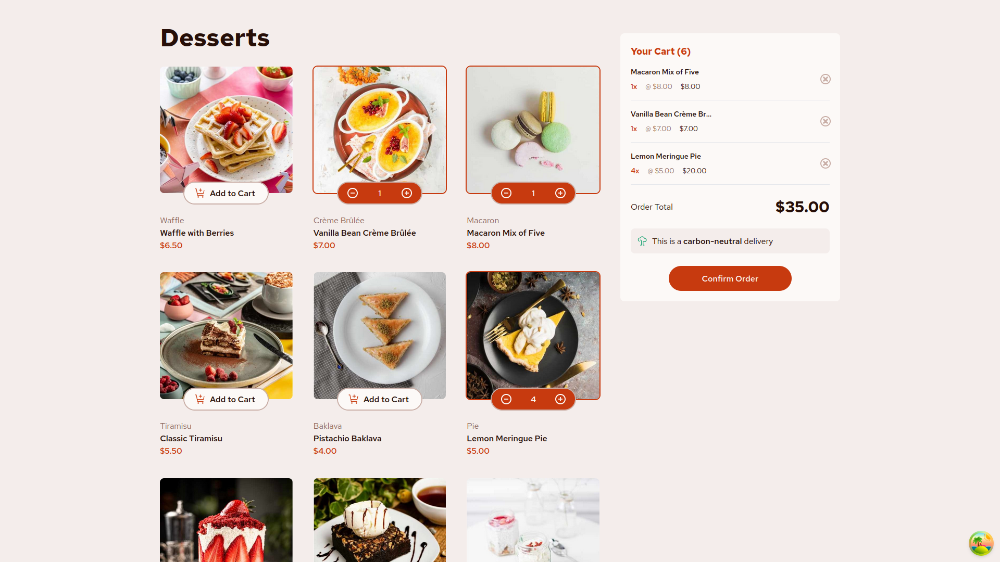

# Frontend Mentor - Product list with cart solution

This is a solution to the [Product list with cart challenge on Frontend Mentor](https://www.frontendmentor.io/challenges/product-list-with-cart-5MmqLVAp_d). Frontend Mentor challenges help you improve your coding skills by building realistic projects.

## Table of contents

- [Overview](#overview)
  - [The challenge](#the-challenge)
  - [Screenshot](#screenshot)
  - [Links](#links)
- [My process](#my-process)
  - [Built with](#built-with)
  - [What I learned](#what-i-learned)
  - [Continued development](#continued-development)
- [Author](#author)

## Overview

### The challenge

Users should be able to:

- Add items to the cart and remove them
- Increase/decrease the number of items in the cart
- See an order confirmation modal when they click "Confirm Order"
- Reset their selections when they click "Start New Order"
- View the optimal layout for the interface depending on their device's screen size
- See hover and focus states for all interactive elements on the page

### Screenshot

### Links

- Solution URL: [Github](https://github.com/medaich/Product-list-with-cart)
- Live Site URL: [Vercel](https://product-list-with-cart-green.vercel.app/)

## My process

### Built with

- Semantic HTML5 markup
- Flexbox
- Mobile-first workflow
- [Tailwind](https://tailwindcss.com/) - css utility first framework
- [Styled Components](https://styled-components.com/)
- [React](https://reactjs.org/) - JS library
- [Tanstack Query](https://tanstack.com/) - JS library

### What I learned

I've learned some Tailwind utilities to simplify the life styling my components. And also I've created a reusable Modal component using React Compound Component pattern.

### Continued development

I'd like to continue improving my styling capabilities and my React skills building a lot of projects experimenting its powerful ecosystem using React Tanstack (React Query) for remote state, useReducer, context API, Redux and Redux Toolkit for global state, and also React Patterns such as Compound Component, HOC and render prop. After building powerful projects with React Nextjs would be the next station.

## Author

- Frontend Mentor - [@medaich](https://www.frontendmentor.io/profile/medaich)
- Twitter - [@medaichx](https://www.twitter.com/medaichx)
